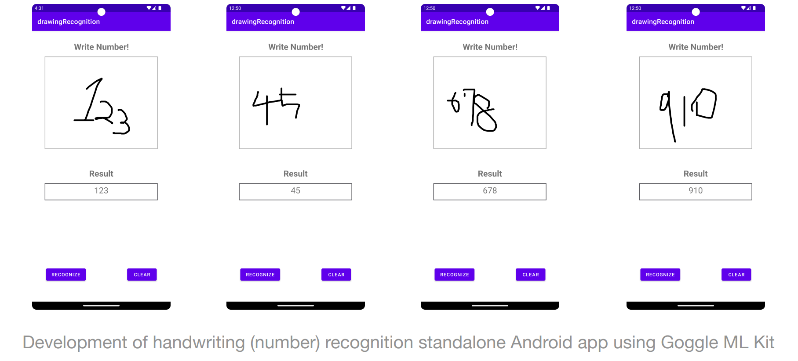
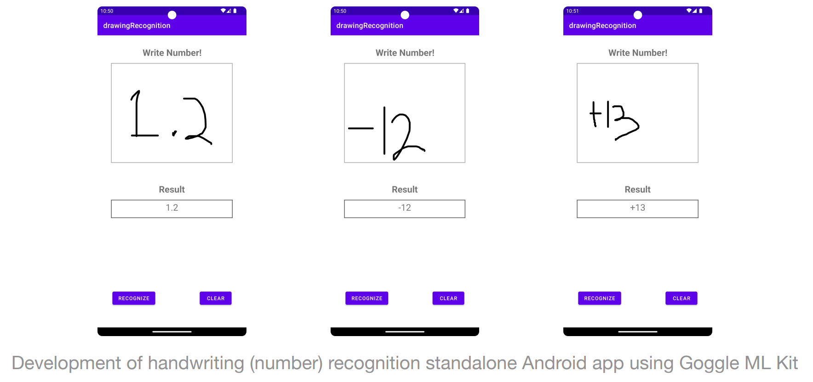

# AndroidProject
최신컴퓨터공학1 project

Development of handwriting (number) recognition standalone Android app using Google ML Kit

### Google ML Kit을 이용한 손글씨(숫자) 인식 standalone Android App 개발 프로젝트

## App 구성
  1. Canvas: 'Write number!'라는 문구 밑 손글씨 입력 가능
  2. Result: 예측된 값 표시
  3. Recognize: 입력된 손글씨 예측하기 버튼
  4. Clear: 손글씨 지우기 버튼

## Demo IMG.

